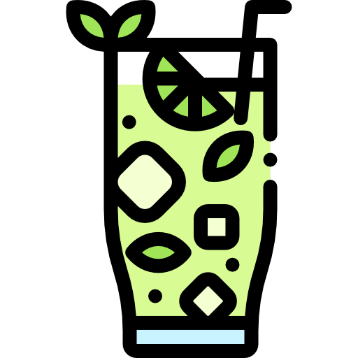

# mojito.css

A tiny utility-class engine for HTML. No build step, no stylesheet, just drop in the script and start using classes.

## Setup

```html
<script src="script.js"></script>
```

Then use `moji-` classes on any element:

```html
<div class="moji-flex moji-p-16 moji-bg-grey moji-text-white">
  hello world
</div>
```

The script scans all elements with a `moji-` class on page load and injects inline styles automatically.

---

## Dynamic Classes

Any number works. You don't need to predefine values.

<details>
<summary>Show dynamic classes</summary>

| Class | Output |
|-------|--------|
| `moji-p-{n}` | `padding: npx` |
| `moji-m-{n}` | `margin: npx` |
| `moji-pt-{n}` | `padding-top: npx` |
| `moji-pb-{n}` | `padding-bottom: npx` |
| `moji-pl-{n}` | `padding-left: npx` |
| `moji-pr-{n}` | `padding-right: npx` |
| `moji-px-{n}` | `padding-left + padding-right: npx` |
| `moji-py-{n}` | `padding-top + padding-bottom: npx` |
| `moji-mt-{n}` | `margin-top: npx` |
| `moji-mb-{n}` | `margin-bottom: npx` |
| `moji-ml-{n}` | `margin-left: npx` |
| `moji-mr-{n}` | `margin-right: npx` |
| `moji-mx-{n}` | `margin-left + margin-right: npx` |
| `moji-my-{n}` | `margin-top + margin-bottom: npx` |
| `moji-fs-{n}` | `font-size: npx` |
| `moji-fw-{n}` | `font-weight: n` |
| `moji-lh-{n}` | `line-height: n` |
| `moji-ls-{n}` | `letter-spacing: npx` |
| `moji-br-{n}` | `border-radius: npx` |
| `moji-w-{n}` | `width: npx` |
| `moji-h-{n}` | `height: npx` |
| `moji-gap-{n}` | `gap: npx` |
| `moji-z-{n}` | `z-index: n` |
| `moji-op-{n}` | `opacity: n` |
| `moji-border-{n}` | `border-width: npx` |

</details>

---

## Static Classes

<details>
<summary>Background</summary>

| Class | Output |
|-------|--------|
| `moji-bg-red` | `background-color: red` |
| `moji-bg-blue` | `background-color: blue` |
| `moji-bg-green` | `background-color: green` |
| `moji-bg-grey` | `background-color: grey` |
| `moji-bg-white` | `background-color: white` |
| `moji-bg-black` | `background-color: black` |
| `moji-bg-yellow` | `background-color: yellow` |

</details>

<details>
<summary>Text Color</summary>

| Class | Output |
|-------|--------|
| `moji-red` | `color: red` |
| `moji-blue` | `color: blue` |
| `moji-green` | `color: green` |
| `moji-text-red` | `color: red` |
| `moji-text-blue` | `color: blue` |
| `moji-text-green` | `color: green` |
| `moji-text-white` | `color: white` |
| `moji-text-black` | `color: black` |
| `moji-text-grey` | `color: grey` |

</details>

<details>
<summary>Display</summary>

| Class | Output |
|-------|--------|
| `moji-flex` | `display: flex` |
| `moji-block` | `display: block` |
| `moji-inline` | `display: inline` |
| `moji-inline-block` | `display: inline-block` |
| `moji-grid` | `display: grid` |
| `moji-hidden` | `display: none` |

</details>

<details>
<summary>Flexbox</summary>

| Class | Output |
|-------|--------|
| `moji-justify-center` | `justify-content: center` |
| `moji-justify-start` | `justify-content: flex-start` |
| `moji-justify-end` | `justify-content: flex-end` |
| `moji-justify-between` | `justify-content: space-between` |
| `moji-justify-around` | `justify-content: space-around` |
| `moji-align-center` | `align-items: center` |
| `moji-align-start` | `align-items: flex-start` |
| `moji-align-end` | `align-items: flex-end` |
| `moji-flex-col` | `flex-direction: column` |
| `moji-flex-row` | `flex-direction: row` |
| `moji-flex-wrap` | `flex-wrap: wrap` |

</details>

<details>
<summary>Typography</summary>

| Class | Output |
|-------|--------|
| `moji-bold` | `font-weight: bold` |
| `moji-italic` | `font-style: italic` |
| `moji-underline` | `text-decoration: underline` |
| `moji-uppercase` | `text-transform: uppercase` |
| `moji-lowercase` | `text-transform: lowercase` |
| `moji-capitalize` | `text-transform: capitalize` |
| `moji-text-center` | `text-align: center` |
| `moji-text-left` | `text-align: left` |
| `moji-text-right` | `text-align: right` |

</details>

<details>
<summary>Sizing and Misc</summary>

| Class | Output |
|-------|--------|
| `moji-w-full` | `width: 100%` |
| `moji-h-full` | `height: 100%` |
| `moji-w-half` | `width: 50%` |
| `moji-h-half` | `height: 50%` |
| `moji-rounded` | `border-radius: 4px` |
| `moji-rounded-full` | `border-radius: 9999px` |
| `moji-shadow` | `box-shadow: 0 2px 8px rgba(0,0,0,0.2)` |
| `moji-cursor-pointer` | `cursor: pointer` |
| `moji-overflow-hidden` | `overflow: hidden` |

</details>

---

Made by [@realSUDO](https://github.com/realSUDO)
